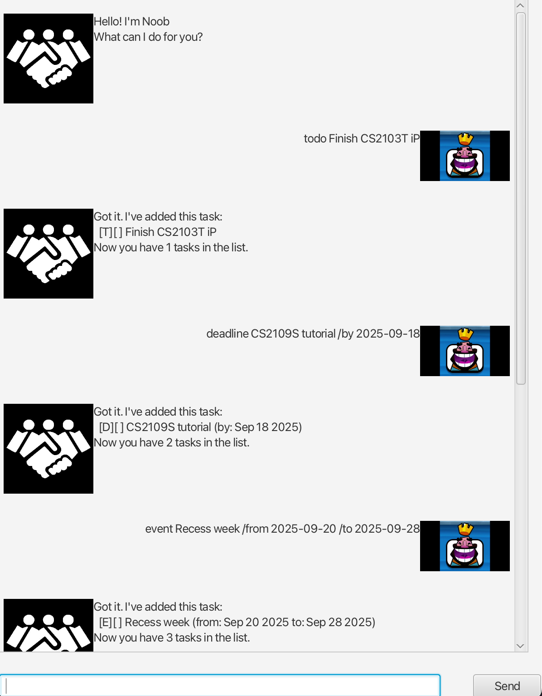

# Noob User Guide



NoobBot is a simple task manager where you can add tasks and keep track of your todos, deadlines and events all in one place.

## Adding Todo Tasks

You may add your todo task to the list of tasks, which will be stored in a local text file for retrieval.

Example: `todo Grocery shopping`

You will receive a confirmation message displaying your task's type [T], completion status, and description. The updated number
of tasks in the list will also be displayed accordingly.

```
Got it. I've added this task:
  [T][] Grocery shopping
Now you have 1 tasks in the list.
```

## Adding Deadline Tasks

You may add tasks that have a set deadline by including `/by yyyy-mm-dd` in your command.

Example: `deadline CS2103T iP /by 2025-09-19`

You will receive a confirmation message displaying your task's type [D] and other fields just like for todo tasks.
Additionally, the deadline for this task will also be displayed.

```
Got it. I've added this task:
  [D][] CS2103T iP (by: Sep 19 2025)
Now you have 2 tasks in the list.
```

## Adding Event Tasks

You may also add tasks spanning over specific dates by including `/from yyyy-mm-dd` and `/to yyyy-mm-dd`.

Example: `event Recess week /from 2025-09-20 /to 2025-09-28`

It will similarly be added to the list, displaying the task's type [E] and the event duration along with other task details.

```
Got it. I've added this task:
  [E][] Recess week (from: Sep 20 2025 to: Sep 28 2025)
Now you have 3 tasks in the list.
```

## Displaying Tasks

Displays the current list of tasks.

Example: `list`

```
1. [T][] Grocery shopping
2. [D][] CS2103T iP (by: Sep 19 2025)
3. [E][] Recess week (from: Sep 20 2025 to: Sep 28 2025)
```

## Marking and Unmarking Tasks

You can mark tasks as done upon completion, or unmark any task marked done by mistake.

Example: `mark 2`

```
Nice! I've marked this task as done:
  [D][X] CS2103T iP (by: Sep 19 2025)
```

Example: `unmark 2`

```
Okay, I've marked this task as not done yet:
  [D][] CS2103T iP (by: Sep 19 2025)
```

## Deleting Tasks

Tasks can be deleted from the list.

Example: `delete 1`

```
Noted. I've removed this task:
  [T][] Grocery shopping
Now you have 2 tasks in the list.
```

## Finding Tasks

You may search for any task in the list containing the search input by using the `find` command.
The search input is case-insensitive and will match all task descriptions containing the search input.

Example: `find recess`

```
Here are the matching tasks in your list:
1. [E][] Recess week (from: Sep 20 2025 to: Sep 28 2025)
```

## Exiting Chat

Exit the application by entering the `exit` command.

## Command List

For a detailed list of commands and their descriptions, run the `help` command.